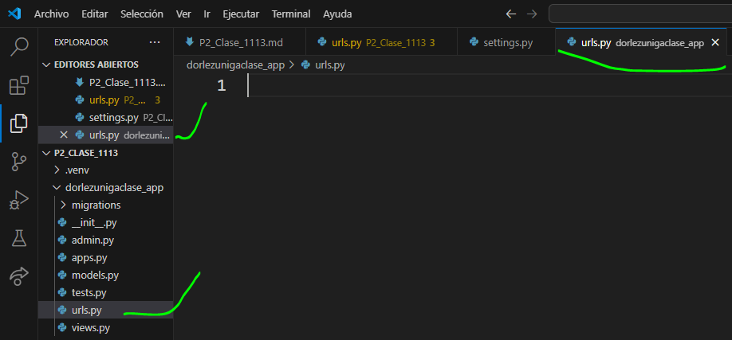
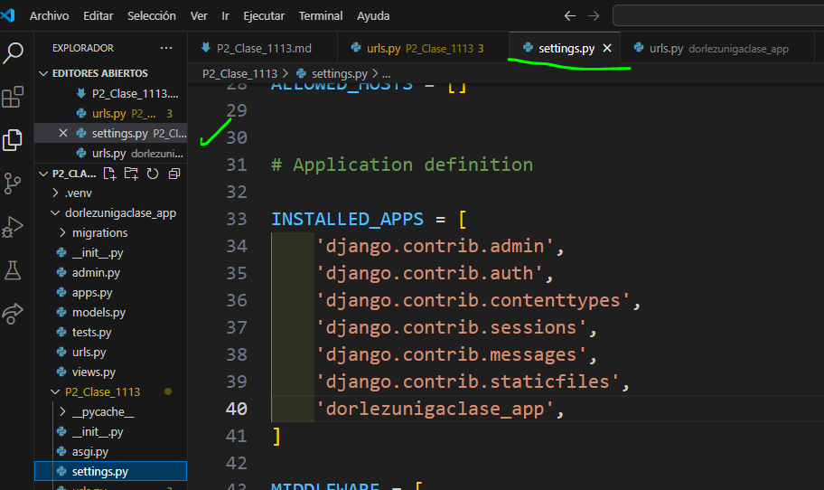
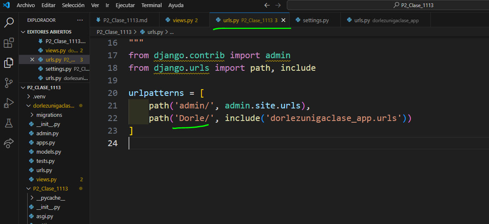
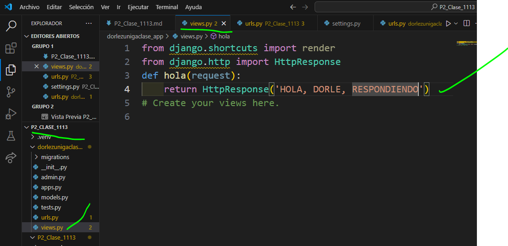
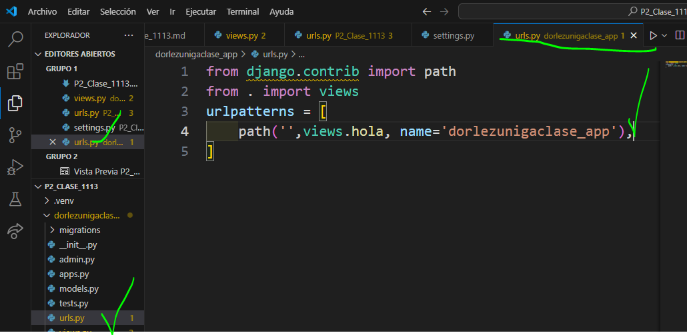

- crear aplicacion dorlezunigaclase_app
- comando --> python manage.py startapp dorlezunigaclase_app
- creamos el archivo urls.py en dorlezunigaclase_app
- 
- en setting.py de P2_Clase_1113
- 
- en urls.py de P2_Clase_1113
- 
- en urls.py de dorlezunigaclase_app
- 
- en views.py en dorlezunigaclase_app
- 
- en urls.py dorlezunigaclase_app
- 